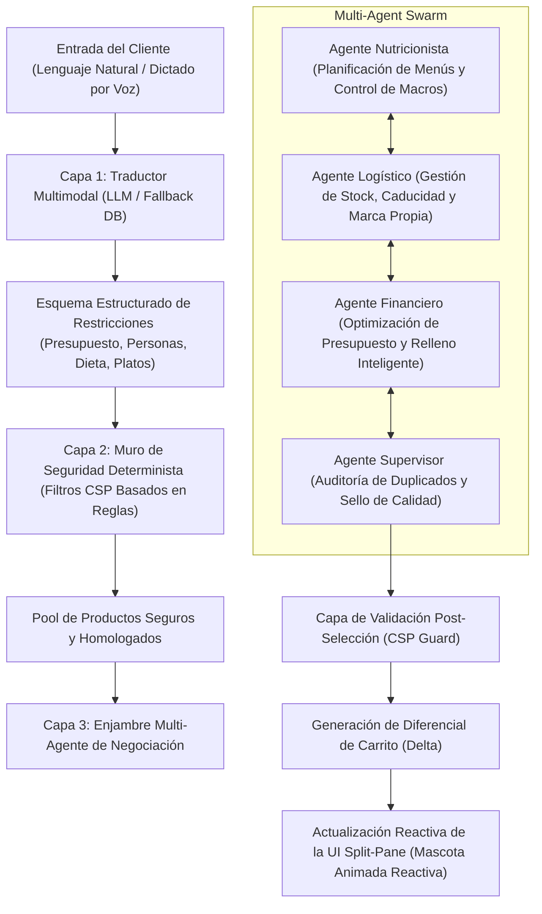

# 🦔 MERCADONA AUTOPILOT (MERCADÍN)
## Especificación Funcional, Técnica y Arquitectura de Software

---

### **CONTROL DE DOCUMENTO**

| **Detalle** | **Información** |
| :--- | :--- |
| **Proyecto** | INFADE_GPI - Mercadona Autopilot / Mercadín |
| **Organización** | Universidad - INFADE |
| **Fecha de Creación** | 27 de Mayo de 2026 |
| **Versión Actual** | 2.0.0 (Estable) |
| **Estado** | Aprobado / Finalizado |
| **Autoría** | Célula de Desarrollo Scrum |

---

## 1. RESUMEN EJECUTIVO

**Mercadona Autopilot (Mercadín)** es un sistema de software inteligente de última generación diseñado para resolver el problema de la **carga mental** asociada a la planificación alimentaria y la realización de la compra semanal de comestibles.

La mayoría de los compradores pierden horas decidiendo qué cocinar, verificando alérgenos familiares, calculando presupuestos y revisando fechas de caducidad. Mercadona Autopilot actúa como un co-piloto interactivo que asume estas tareas complejas en segundos. A través de un motor híbrido que unifica la inteligencia conversacional y el razonamiento lógico matemático, la plataforma genera automáticamente cestas de la compra optimizadas y seguras basándose en restricciones estrictas e inputs en lenguaje natural o por voz.

---

## 2. EL EQUIPO SCRUM

El desarrollo del sistema se ha regido bajo el marco metodológico **Scrum**, permitiendo pivotar y refinar el producto de forma iterativa y colaborativa en cada Sprint:

*   **Scrum Master:** Edgar Gisbert
*   **Product Owner:** Hugo Esclapez
*   **Equipo de Desarrollo (DevOps / Backend / Frontend):**
    *   Iñaki Aguilar
    *   Malena Belda
    *   Jorge Martínez
    *   Marcos Manén

---

## 3. ARQUITECTURA TÉCNICA HÍBRIDA (CSP-LLM)

El núcleo tecnológico del software radica en su **arquitectura híbrida**, la cual se divide en un pipeline secuencial de tres capas principales diseñado para conjugar flexibilidad conversacional con seguridad de datos de grado médico.



### 3.1. Capa 1: Traductor Multimodal (Procesamiento NLP e Inteligencia Artificial)
La primera barrera traduce el lenguaje natural informal del usuario en directivas de base de datos comprensibles.
*   **Tecnología Base:** Google Gemini (`gemini-2.0-flash`) y APIs auxiliares de Groq.
*   **Gestión de Alta Disponibilidad (Resiliencia):** En caso de agotamiento de cuotas (HTTP 429) o fallos de red externos, el sistema implementa un **motor semántico local deterministic fallback** ([llm_translator.py](file:///d:/GPI/src/backend/llm_translator.py)). Este módulo analiza la frase mediante expresiones regulares y lógica booleana recursiva, cruzándola con un diccionario local enriquecido (`_RECIPE_DB`, `_RECIPE_BASES`, `_RECIPE_VARIANTS`) para extraer los ingredientes base correspondientes sin interrumpir el servicio.
*   **Fichero de Referencia:** [llm_translator.py](file:///d:/GPI/src/backend/llm_translator.py)

### 3.2. Capa 2: Muro Determinista de Alérgenos y Dietas (CSP en Python)
Los Modelos de Lenguaje Grande (LLM) son probabilísticos y propensos a la alucinación, lo que representa un riesgo inaceptable en alergias alimenticias graves. Mercadona Autopilot resuelve esto interponiendo un **muro determinista CSP (Constraint Satisfaction Problem)** estricto.
*   **Mapeo Predictivo de Alérgenos:** Dado que muchas referencias de productos en las APIs públicas de supermercados omiten el etiquetado digital detallado, [csp_filter.py](file:///d:/GPI/src/backend/csp_filter.py) cuenta con un mapa exhaustivo de palabras clave (ej. *harina*, *trigo*, *sémola* para **Gluten**; *leche*, *nata*, *queso* para **Lactosa**). El filtro barra inmediatamente del pool de candidatos cualquier producto que contenga la palabra en su nombre, categoría o subcategoría.
*   **Filtros Dietéticos:** Eliminación automatizada de categorías de carnicería y pescadería para usuarios vegetarianos, y lácteos/huevos en caso de perfiles veganos.
*   **Fichero de Referencia:** [csp_filter.py](file:///d:/GPI/src/backend/csp_filter.py)

### 3.3. Capa 3: Enjambre Multi-Agente (Swarm de Negociación)
Una vez pre-filtrados los productos seguros, se activa un enjambre de micro-agentes que negocian la composición perfecta del carrito:
*   **Agente Nutricionista:** Analiza el valor calórico y los macronutrientes (proteínas, hidratos de carbono, grasas). Prioriza la variedad alimentaria y asocia los ingredientes deducidos con los productos del catálogo de mayor calidad nutricional.
*   **Agente Logístico:** Responsable del control de pérdidas y la maximización de la rentabilidad del supermercado. Por un lado, prioriza la marca blanca propia (**Hacendado**) si el perfil del usuario lo requiere; por otro, analiza la fecha de caducidad (`days_to_expiry`) para colocar en el carrito lotes que tengan una fecha de vencimiento más próxima, combatiendo activamente el desperdicio alimentario.
*   **Agente Financiero:** Encargado de la economía del ticket. En el flujo dinámico de modificaciones (deltas), garantiza que se mantengan los ingredientes obligatorios de la receta pero emite alertas claras si se excede el presupuesto por compra. Si el coste de los ingredientes esenciales está muy por debajo del presupuesto máximo, el agente rellena autónomamente el carrito con complementos coherentes (sal, agua, pan, frutas de temporada) escalados según el número de personas del hogar.
*   **Agente Supervisor:** Actúa como auditor final. Elimina duplicados accidentales, valida que los precios cuadren al céntimo y estampa el sello de calidad final.
*   **Fichero de Referencia:** [agents.py](file:///d:/GPI/src/backend/agents.py)

---

## 4. EVOLUCIÓN HISTÓRICA POR SPRINTS

El desarrollo tecnológico de la plataforma ha seguido una hoja de ruta ágil, pivotando desde un modelo estático hacia un sistema interactivo y de alta fidelidad:

### 🚀 Sprint 1: Arquitectura Base y Motor Híbrido (V1)
*   **Hito Principal:** Estructuración inicial del catálogo SQLite con 200 referencias reales de productos de Mercadona.
*   **Implementación:** Desarrollo del motor básico del CSP y el primer pipeline de procesamiento de texto con APIs de Inteligencia Artificial para derivar restricciones de dietas y alérgenos.

### 🚀 Sprint 2: Enjambre Multi-Agente y UI Estática (V1.5)
*   **Hito Principal:** Integración de la lógica trilateral cooperativa de agentes.
*   **Flujo "One-Shot":** El usuario introducía una frase inicial (ej. "Compra para dos vegetarianos por 40€") y el backend procesaba la solicitud en un bloque cerrado, devolviendo una lista estática sin posibilidad de diálogo.
*   **UI Lineal:** Interfaz de usuario básica que mostraba visualmente cada fase de análisis (Análisis de entrada -> Muro CSP -> Ejecución de Agentes -> Resultados).

### 🚀 Sprint 3: Asistente Conversacional "Mercadín" (V2 - Actual)
*   **Hito Principal:** Pivotaje estratégico del modelo hacia la retención y la fidelización del usuario mediante gamificación e interactividad.
*   **Identidad Visual (Mercadín 🦔):** Diseño del erizo virtual interactivo que actúa como la cara visible de la IA.
*   **Pantalla Dividida (Split-Pane SPA):** Panel de conversación reactivo a la izquierda e interfaz gráfica dinámica del carrito a la derecha para un feedback instantáneo.
*   **Lógica de Modificaciones Incrementales (Deltas):** Capacidad del motor de procesar cambios atómicos ("quita las patatas y pon zanahorias", "añade fruta para postre") sin regenerar toda la compra desde cero, manteniendo la memoria del estado anterior.
*   **Recomendaciones Proactivas:** Conexión con señales temporales e históricas del usuario (momento del día, estación climática, productos cercanos a expirar en su inventario virtual y hábitos anteriores) para sugerir compras inteligentes en el saludo de entrada.
*   **Exportación Estética de Menús:** Implementación de un generador dinámico de PDFs y ficheros HTML portables que compila la planificación semanal, la lista de ingredientes y las recetas detalladas para uso offline.

---

## 5. MODELO DE DATOS Y ESQUEMA RELACIONAL (SQLite)

La persistencia del sistema está centralizada en una base de datos relacional SQLite (`mercadona.db`).
*   **Fichero de Referencia:** [database.py](file:///d:/GPI/src/backend/database.py)

```
+-------------------+        1 : N        +-------------------+
|   user_profile    | ------------------- |   chat_sessions   |
+-------------------+                     +-------------------+
| id (PK)           |                     | id (PK)           |
| name              |                     | user_id (FK)      |
| people            |                     | messages          |
| allergens         |                     | cart_state        |
| diet              |                     | constraints       |
| monthly_budget    |                     | status            |
| per_cart_budget   |                     | created_at        |
| month_spent       |                     | updated_at        |
| brand_preference  |                     +-------------------+
+-------------------+                               |
          | 1                                       | 1
          |                                         |
          | N                                       | N
+-------------------+                     +-------------------+
| purchase_history  | ------------------- |     products      |
+-------------------+        N : M        +-------------------+
| id (PK)           |                     | id (PK)           |
| user_id (FK)      |                     | name, brand       |
| session_id (FK)   |                     | category, price   |
| products (JSON)   |                     | unit_size, format |
| total             |                     | allergens (JSON)  |
| notes, created_at |                     | days_to_expiry    |
+-------------------+                     +-------------------+
```

### 5.1. Estructura de la Tabla `products`
| Campo | Tipo de Datos | Restricciones | Propósito |
| :--- | :--- | :--- | :--- |
| `id` | INTEGER | PRIMARY KEY | Identificador interno del registro. |
| `mercadona_id` | TEXT | UNIQUE | Código de barras o ID oficial en Mercadona España. |
| `name` | TEXT | NOT NULL | Nombre descriptivo del producto en el lineal. |
| `brand` | TEXT | NOT NULL | Fabricante (Hacendado, Premium, Marca propia). |
| `category` | TEXT | NOT NULL | Categoría principal de clasificación comercial. |
| `subcategory` | TEXT | NOT NULL | Clasificación específica para filtros finos. |
| `price` | REAL | NOT NULL | Precio de venta al público en euros. |
| `unit_size` | REAL | DEFAULT 0 | Peso neto, unidades o volumen del artículo. |
| `size_format` | TEXT | DEFAULT '' | Formato de unidad de medida (g, kg, L, ml). |
| `packaging` | TEXT | DEFAULT '' | Envase del alimento (Bandeja, Bolsa, Pack). |
| `allergens` | TEXT | DEFAULT '[]' | JSON array conteniendo alérgenos declarados. |
| `kcal_100g` | REAL | DEFAULT 0 | Kilocalorías por cada 100 gramos de porción. |
| `protein_100g` | REAL | DEFAULT 0 | Gramos de proteína por 100g de alimento. |
| `carbs_100g` | REAL | DEFAULT 0 | Gramos de hidratos de carbono por 100g. |
| `fat_100g` | REAL | DEFAULT 0 | Gramos de grasas por 100g. |
| `days_to_expiry` | INTEGER | DEFAULT 180 | Vida útil restante promedio en días. |
| `image_url` | TEXT | DEFAULT '' | Enlace a la imagen del producto (para scraper). |

### 5.2. Estructura de la Tabla `chat_sessions`
| Campo | Tipo de Datos | Restricciones | Propósito |
| :--- | :--- | :--- | :--- |
| `id` | TEXT | PRIMARY KEY | UUID de la sesión de conversación. |
| `user_id` | INTEGER | FK -> `user_profile(id)` | Identificador del usuario que compra. |
| `messages` | TEXT | NOT NULL | Historial completo de mensajes en formato JSON. |
| `cart_state` | TEXT | NOT NULL | JSON que almacena el contenido actual de la cesta. |
| `constraints` | TEXT | NOT NULL | Alérgenos, dietas y presupuesto acumulados en la sesión. |
| `status` | TEXT | DEFAULT 'active' | Estado del flujo ("active" / "confirmed"). |
| `created_at` | TEXT | NOT NULL | Fecha de inicio de la sesión. |

### 5.3. Estructura de la Tabla `user_profile`
| Campo | Tipo de Datos | Restricciones | Propósito |
| :--- | :--- | :--- | :--- |
| `id` | INTEGER | PRIMARY KEY | ID del usuario. |
| `name` | TEXT | NOT NULL | Nombre del cliente para personalización del chat. |
| `people` | INTEGER | NOT NULL | Personas que integran la unidad familiar. |
| `allergens` | TEXT | DEFAULT '[]' | Restricciones médicas permanentes (JSON). |
| `diet` | TEXT | DEFAULT 'equilibrada' | Dieta permanente del usuario. |
| `monthly_budget` | REAL | NOT NULL | Presupuesto total asignado para el mes. |
| `per_cart_budget` | REAL | NOT NULL | Límite máximo aconsejado por pedido singular. |
| `month_spent` | REAL | DEFAULT 0.0 | Acumulador de gasto total facturado en el mes. |
| `brand_preference` | TEXT | DEFAULT 'Hacendado' | Preferencia predeterminada de marcas. |

---

## 6. ESPECIFICACIÓN DE LA API REST (FastAPI)

El backend de FastAPI expone una interfaz limpia, segura y documentada mediante OpenAPI / Swagger.
*   **Fichero de Referencia:** [main.py](file:///d:/GPI/src/backend/main.py)

### 6.1. Endpoints de Conversación y Carrito Activo

#### `POST /api/chat/start`
*   **Descripción:** Genera un identificador de sesión y compila el saludo de Mercadín.
*   **Carga de Entrada:** Ninguna (lee el perfil persistido automáticamente).
*   **Estructura de Respuesta:**
    ```json
    {
      "session_id": "9b1deb4d-3b7d-4bad-9bdd-2b0d7b3dcb6d",
      "greeting": "¡Hola, Jefe Hugo! Qué alegría tenerte de vuelta. He notado que en tu nevera quedan algunos productos de pollo cerca de caducar, ¿te apetece que preparemos unos muslos al horno con patatas hoy?",
      "suggestions": [
        "Preparar Pollo al Horno",
        "Compra básica de Lácteos",
        "Menú vegetariano semanal"
      ],
      "profile_summary": {
        "name": "Hugo",
        "people": 2,
        "allergens": ["gluten"],
        "diet": "equilibrado",
        "per_cart_budget": 25.0,
        "monthly_remaining": 175.40
      },
      "demo_mode": false
    }
    ```

#### `POST /api/chat/message`
*   **Descripción:** Procesa el prompt conversacional de compra o alteración del carrito.
*   **Cuerpo de Petición:**
    ```json
    {
      "session_id": "9b1deb4d-3b7d-4bad-9bdd-2b0d7b3dcb6d",
      "message": "Añade los ingredientes para una tortilla española, pero cambia la cebolla por calabacín",
      "ai_mode": "gemini"
    }
    ```
*   **Estructura de Respuesta:** Retorna el mensaje de texto de Mercadín, el delta de productos añadidos/eliminados, el carrito completo recalculado y las trazas detalladas de la negociación del enjambre.

#### `POST /api/chat/confirm`
*   **Descripción:** Cierra la compra, registra el pedido en el histórico y realiza el cargo contra el saldo mensual disponible del usuario.

#### `POST /api/recipe/download`
*   **Descripción:** Recibe la receta en caliente y descarga un HTML maquetado con estilos CSS en bebidas y cuadrículas para poder imprimir o visualizar la lista del supermercado y el paso a paso cómodamente en papel o móvil offline.

---

## 7. DISEÑO DE INTERFAZ Y EXPERIENCIA DE USUARIO (UI)

La interfaz se ha programado íntegramente utilizando componentes reactivos con **React SPA** y un motor visual limpio basado en Vanilla CSS, permitiendo una adaptabilidad perfecta a dispositivos móviles y ordenadores de escritorio.
*   **Fichero de Referencia:** [index.html](file:///d:/GPI/src/ui/index.html) y [style.css](file:///d:/GPI/src/ui/style.css)

### 7.1. Distribución de Pantalla Dividida (Split-Pane)
1.  **Panel de Conversación (Izquierdo):**
    *   **Diseño:** Estilo chat premium con degradados suaves y cajas de texto de contraste limpio.
    *   **Control por Voz (Speech-to-Text):** Integra un botón de micrófono que se conecta directamente a la API nativa de reconocimiento de voz del navegador (`webkitSpeechRecognition`), permitiendo al usuario dictar ingredientes sin necesidad de teclear.
    *   **Historial Fluido:** Animaciones de transición suaves al recibir mensajes.
2.  **Panel de Visualización de Cesta (Derecho):**
    *   **Control de Presupuesto:** Una barra horizontal dinámica de progreso que pasa de tonos verdes (compra segura) a amarillos/rojos cuando la suma del importe total se aproxima o supera el límite del perfil del cliente.
    *   **Simplicidad Libre de Distracción:** A petición del usuario final, se eliminaron los cargadores lentos de imágenes web externas de alimentos. En su lugar, el carrito renderiza de forma óptima un **identificador emoji de categoría** (ej. 🥛 para lácteos, 🥩 para carnes, 🥬 para verduras) que agiliza drásticamente la velocidad de carga y aporta una lectura limpia y corporativa del ticket.

### 7.2. Lógica del Avatar Animado de Mercadín 🦔
Para dotar al asistente de vida propia, la mascota se renderiza como un reproductor de vídeo interactivo que cambia de estado según las interacciones del cliente:

```
+-----------------------------------+
|         Usuario en Espera         |
+-----------------------------------+
                  |
                  v
       +--------------------+
       | Loop: pensando.mp4 |
       +--------------------+
                  |
                  |  Se detectan artículos añadidos
                  |  (cart_delta.added.length > 0)
                  v
      +----------------------+
      | Play Once:           |
      | añadiendo.mp4        |
      +----------------------+
                  |
                  |  Evento: onEnded (Final del vídeo)
                  v
       +--------------------+
       | Retorno a loop     |
       | pensando.mp4       |
       +--------------------+
```

Este comportamiento asegura una experiencia gamificada y orgánica, dando la sensación de que el erizo está metiendo activamente los alimentos en la bolsa del cliente de forma fluida.

---

## 8. GUÍA DE INSTALACIÓN, CONFIGURACIÓN Y DESPLIEGUE

### 8.1. Requisitos de Entorno
*   Python 3.10 o superior.
*   Navegador web moderno compatible con la API de Reconocimiento de Voz (Google Chrome, Microsoft Edge, Safari).

### 8.2. Pasos de Instalación y Ejecución

1.  **Activación de Entorno Virtual en PowerShell (Windows):**
    ```powershell
    python -m venv .venv
    .\.venv\Scripts\Activate.ps1
    ```
2.  **Instalación de Dependencias:**
    ```bash
    pip install -r requirements.txt
    ```
3.  **Configuración de las Llaves API (API Keys):**
    Asegúrese de configurar sus credenciales de IA en el archivo [config.py](file:///d:/GPI/src/backend/config.py):
    ```python
    GEMINI_API_KEY = "TU_API_KEY_DE_GEMINI"
    GROQ_API_KEY = "TU_API_KEY_DE_GROQ"
    ```
    *Si las API keys no están configuradas correctamente o se detecta que no tienen el prefijo oficial, el sistema cambiará automáticamente al **Modo Demo**, garantizando la total operatividad del sistema mediante su base de datos local y su motor de scoring determinista.*

4.  **Lanzamiento del Servidor de Producción/Desarrollo (Uvicorn):**
    ```bash
    python -m uvicorn src.backend.main:app --reload --host 127.0.0.1 --port 8000
    ```
5.  **Acceso a la Aplicación:**
    Abra su navegador web favorito e introduzca la URL:
    👉 [http://127.0.0.1:8000](http://127.0.0.1:8000)

---
*Este documento constituye la especificación de software oficial del sistema Mercadona Autopilot y sus componentes.*
